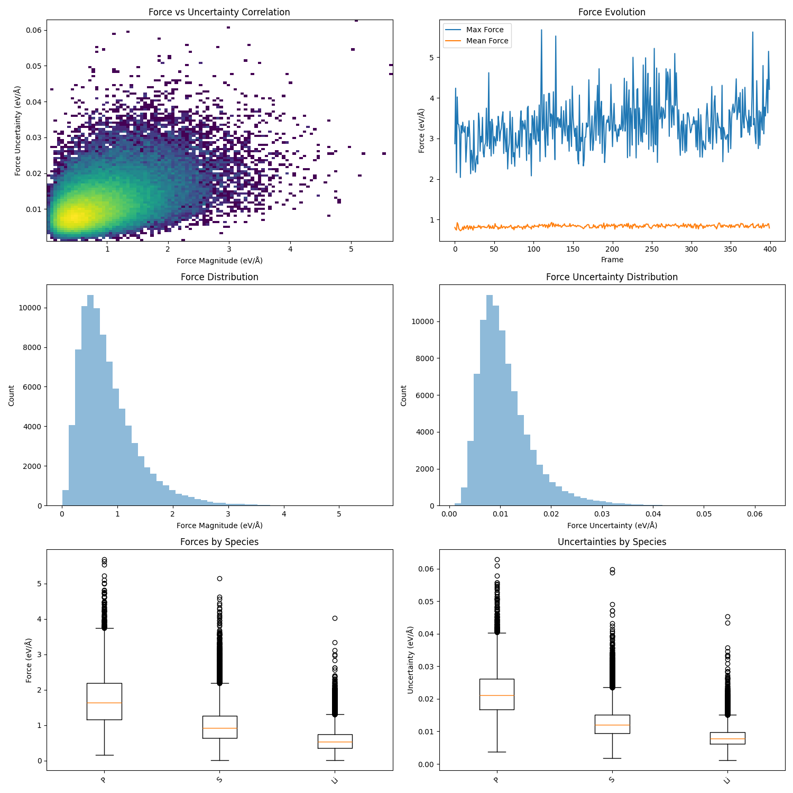
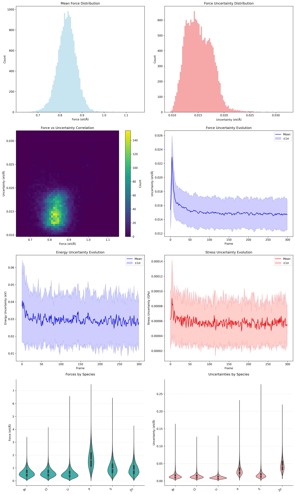
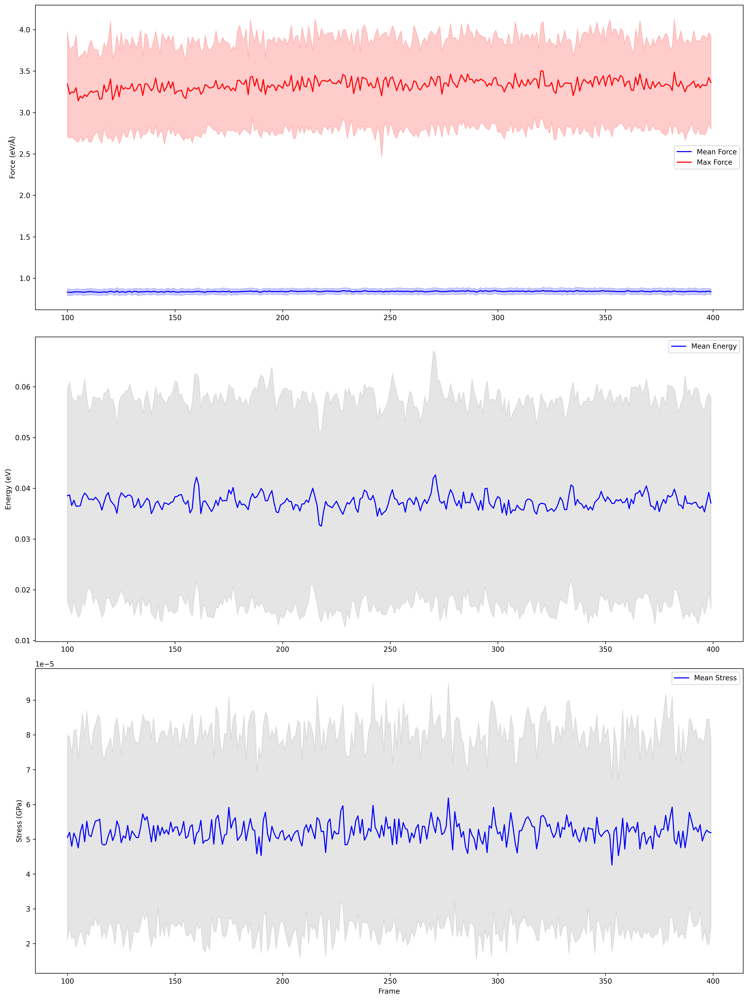
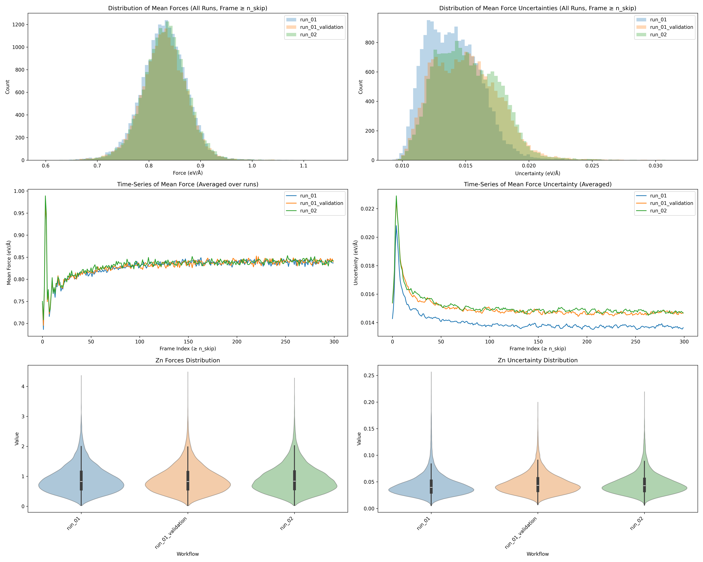

# Active Learning Workflow

A five-step workflow for running Active Learning with a committee of ASE-compatible calculators and subsequently preparing, running, and collecting VASP-based high-level calculations. The high-level idea:

1) From an XYZ file (easily modifiable to be any list of structures), run a committee of ML potentials to generate trajectories and their associated errors (force, stress, and energy uncertainties).

2) Aggregate the results, produce overall statistics, and identify “worst frames” for further inspection or retraining.

3) *Optional* Compare results between active learning generations!

4) Generate VASP single-point input files (POSCAR, POTCAR, INCAR) for these “worst frames” (or any structures of interest) to obtain higher-fidelity reference data.

5) Submit these single-point jobs to a high-performance cluster using a Slurm job array or equivalent HPC script.

6) Gather the resulting final structures from VASP (e.g., from OUTCARs) and collect them into a single enhanced dataset (extxyz), which can then be used for model retraining or further analysis.

A suggested starting point:

```text
.
├── run_active_learning.py         # Main workflow script
├── input_structures.xyz           # Input structures file
├── models/                        # Model directory
│   ├── deployed_model_0.pth       # Committee model 1
│   ├── deployed_model_1.pth       # Committee model 2
│   └── deployed_model_2.pth       # Committee model 3

```
--------------------------------------------------------------------------------
# (1) run_active_learning.py

Needs to run with a GPU (well, no, but ideally yes).

On Young (an HPC node) you might request an interactive node with something like:
```bash
qrsh -pe smp 8 -l mem=2056M,h_rt=2:00:00,gpu=1,tmpfs=50G -now no -A MCC_bulk_isl
```

This script implements a workflow for:
1. Structure relaxation (optional).  
2. NPT molecular dynamics.  
3. Uncertainty analysis using a committee of models.

### Requirements
- Python 3.8+  
- ASE  
- NequIP (or another ML potential package)  
- NumPy  
- Matplotlib  
- tqdm  

### Directory Structure


Generated output in workflow_results/:

```text
workflow_results/              # Generated output
├── logs/                      # Workflow logs
├── run_0000/                  # Individual run results
│   ├── relaxation.traj
│   ├── npt.extxyz
│   ├── core_stats.npz
│   ├── atom_data.npz
│   └── run_statistics.png
├── run_0001/
├── run_N/
```

### Calculator Configuration

The workflow requires ASE-compatible calculators. By default, we rely on a small "committee" of ML potentials. For example:

```python
# Multiple NequIP models:
from nequip.ase import NequIPCalculator
ASE_CALCULATORS = [NequIPCalculator.from_deployed_model(model_path=f"deployed_model_{i}.pth", 
                                                       device="cuda") for i in range(3)]

# Single MACE model:
from mace.calculators import MACECalculator
ASE_CALCULATORS = [MACECalculator(model_path="model.pt", device="cuda")]
```

Customizing your committee is straightforward:  
• Include any ASE-compatible calculator(s).  
• The first calculator in the list is used for the MD run. The script computes uncertainties by comparing the predictions among all listed calculators.

### Usage

Below is a snippet of configuration for run_active_learning.py:

```python
WORKFLOW_CONFIG = {
    'PATHS': {
        'BASE_DIR': Path('workflow_results'),
        'INPUT_XYZ': Path('generated_structures.xyz'),
        'LOG_DIR': None
    },
    'RELAXATION': { # Optional relaxation, just set this to 0 if you don't want to relax
        'STEPS': 5,
        'FORCE_CONVERGENCE': 0.01
    },
    'NPT': {
        'STEPS': 20,
        'TIME_STEP': 2 * units.fs,
        'PRESSURE': 1.01325 * units.bar,
        'SAVE_INTERVAL': 10,
        'TEMPERATURE': 600,
        'THERMOSTAT_TIME': 25 * units.fs,
        'BAROSTAT_TIME': 100 * units.fs
    },
    'ANALYSIS': {
        'DPI': 300,
        'FIGURE_SIZES': {
            'MAIN': (15, 15),
            'SPECIES': (10, 6)
        }
    },
    'CALCULATORS': ASE_CALCULATORS
}
```

Simply run:
```bash
$ python run_active_learning.py
```

The script will:  
1) Load each frame of generated_structures.xyz.  
2) Optionally perform a relaxation if STEPS > 0 in RELAXATION.  
3) Run an NPT simulation, producing npt.extxyz.  
4) Evaluate uncertainties from the committee and save results as core_stats.npz and atom_data.npz.  
5) Generate a quick figure (run_statistics.png) summarizing forces, uncertainties, and species-specific data.  
6) Store everything in workflow_results/run_XXXX/ directories.

### Example Analysis Plots
Below is an example style of the per-run figure (run_statistics.png):



--------------------------------------------------------------------------------
# (2) generate_plots_and_worst_frames.py

This script processes all the runs in workflow_results/, generates aggregated plots, and (optionally) identifies "worst frames" based on user-defined criteria.

Workflow steps:
1. Search for run_* subdirectories (e.g., run_0000, run_0001, etc.).  
2. Collect statistics from core_stats.npz and atom_data.npz across all runs.  
3. Generate combined histograms, time series, species-based analysis, etc.  
4. Select "worst frames" (high force or high uncertainty) according to configurable CRITERIA.  
5. Output summary plots (analysis.png, time_series.png) and optionally gather worst frames in a single worst_frames.xyz.

### Usage
After you have completed your runs with run_active_learning.py, invoke:
```bash
$ python generate_plots_and_worst_frames.py
```
It reads configuration from RUN_CONFIG in generate_plots_and_worst_frames.py, which includes:

• PATHS.BASE_DIR: the same directory used previously.  
• ANALYSIS.N_SKIP_FRAMES: frames to ignore (e.g., equilibrating).  
• WORST_FRAMES.ENABLED: True or False to enable/disable "worst frame" selection.  
• WORST_FRAMES.CRITERIA: A list of dictionaries specifying which metrics to look at (force vs. energy vs. stress, and max vs. mean, value vs. uncertainty), how many frames to pick, species filters, etc.  
• WORST_FRAMES.WINDOWS: "WITHIN_CRITERION" and "GLOBAL" windows that exclude neighboring frames once one is chosen.

### Directory Structure

```text
workflow_results/
├── analysis/
│   ├── plots/
│   │   ├── analysis.png
│   │   └── time_series.png
│   └── worst_runs/
│       ├──  ** PLOT OF CRITERIA 1 **
│       ├──  worst_frames.json
│       └──  worst_frames.xyz
└── run_*/                 # Original run directories
```
### Example Criterion
```python
'WORST_FRAMES': {
    'ENABLED': True,
    'CRITERIA': [
        {
            'metric': 'force',
            'stat_type': 'max',
            'measure': 'value',
            'n_frames': 10,
            'frame_range': (100, None),
            'within_window': 50
        },
        {
            'metric': 'force',
            'stat_type': 'mean',
            'measure': 'uncertainty',
            'species': 'Zn',
            'n_frames': 20,
            'frame_range': (0, 500),
            'within_window': 25
        }
    ],
    'WINDOWS': {
        'WITHIN_CRITERION': 5,
        'GLOBAL': 2
    }
}
```
Once run, it produces aggregated plots in workflow_results/analysis/plots/ (analysis.png and time_series.png), plus worst-frames data in analysis/worst_runs/.

### Example Analysis Plots

The script generates a summary figure (analysis.png) and a time series plot (time_series.png) across all runs:

analysis.png:


time_series.png:


--------------------------------------------------------------------------------
# (3)*OPTIONAL* Compare Between Active Learning Runs (compare_generations.sh)

Compare several active learning runs, looking at key species metrics etc!

### Usage

Modify the lines: 

```bash
COMPARE_CONFIG = {
    # List of top-level workflow directories to compare.
    # Each directory should contain a subfolder named "workflow_results"
    # that itself contains run_* directories (e.g. run_0000, run_0001, etc.).
    "WORKFLOW_FOLDERS": [
        "run_01",
        "run_01_validation",
        "run_02"
    ],

    "RESULTS_SUBFOLDER": "workflow_results",  # Where run_* directories live
    "OUTPUT_DIR": "compare_analysis",         # Master output directory for the comparison
    "N_SKIP_FRAMES": 0,                       # Number of frames to skip
    "DPI": 300,                               # Figure DPI
    "FIGURE_SIZE": (20, 16),                  # Size of the main comparison figure
    "SPECIES_OF_INTEREST": "Zn"               # Target species for detailed analysis
}
```
to fit your directory structure and active learning run names

The script expects a directory layout as was created above.




--------------------------------------------------------------------------------

# (4) generate_vasp_single_points.py

### Purpose
Generates VASP input files for single-point calculations from an xyz or extxyz file containing multiple structures. Each structure is sorted, wrapped, and placed in its own directory with a POSCAR, POTCAR, and INCAR for easy submission on an HPC environment.

### Created Files

```text

structures.xyz
INCAR

{output_dir}/  
  ├── {structure_name_}0/  
  │    ├── POSCAR  
  │    ├── INCAR  
  │    ├── POTCAR  
  │    └── …  
  ├── {structure_name_}1/  
  ├── …  
```

### Usage
From the command line:

```bash
  python generate_vasp_single_points.py \
      --extxyz_file <path_to_extxyz> \
      --incar_file <path_to_incar> \
      [--output_dir <directory_for_structures>] \
      [--structure_name <prefix_for_subdirectories>]
```
### Arguments
• --extxyz_file (required)  
  Path to the extended XYZ file containing multiple structures.

• --incar_file (required)  
  Path to the INCAR file to be copied (and optionally modified) for each structure.

• --output_dir (optional)  
  Directory where subfolders for each structure will be created (default: current directory).

• --structure_name (optional)  
  Prefix for naming each structure directory (default: "structure_").

### Functionality
1. Reads structures from the provided extended XYZ file.  
2. For each structure:  
   a. Creates a new directory (named by the user-defined prefix + index).  
   b. Writes a POSCAR (by converting the structure to VASP format).  
   c. Generates a POTCAR based on the detected elements (using a predefined mapping to POTCAR directories).  

3. Logs progress and outlines each generated set of VASP input files.

--------------------------------------------------------------------------------
# (5) HPC Submission Script (slurm_submission_script.sh)

Below is a sample Slurm submission script for running VASP on a set of single-point structures generated by the above script.

### Purpose
Provides an example Slurm job array script for batch-processing multiple structure directories using VASP. Useful for automating large numbers of single-point calculations.

### Usage

Modify the line: 

```bash
cd {**PATH_TO_YOUR_STRUCTURE_DIR**}/{structure_name}$SLURM_ARRAY_TASK_ID
```
to fit your directory structure.

To run a range of directories, adjust the #SBATCH --array=0-79%40 line to match the number of structures.

Submit via Slurm:

```bash
sbatch SCAN_zn_active.sh
```

The script expects a directory layout with “structure_0”, “structure_1”, etc., each containing POSCAR, INCAR, POTCAR, etc.


### Script Overview
1. Requests needed compute resources (nodes, tasks, time, etc.) via #SBATCH directives.  
2. Loads the VASP module.  
3. Navigates to the structure directory based on the job array index ($SLURM_ARRAY_TASK_ID).  
4. Runs VASP (vasp_std) with srun, redirecting output to vasp.out.  
5. Renames and copies vasprun.xml to a structure-specific filename for easier reference.

--------------------------------------------------------------------------------
# (6) generate_extxzy_from_vasp_out.py

### Purpose
Extracts final structures from multiple VASP OUTCAR files (one per directory) and combines them into a single extended XYZ (extxyz) file. Typically used after running single-point or relaxation calculations to gather results into one place for further analysis or retraining.

### Usage
From the command line:
  
```bash
  python generate_extxzy_from_vasp_out.py \
      --dir <base_directory> \
      --output <combined_output.extxyz> \
      [--prefix <structure_directory_prefix>]
```

### Arguments
• --dir (required)  
  Base directory containing the VASP run subfolders.

• --output (required)  
  Filename/path for the generated extended XYZ file.

• --prefix (optional)  
  Prefix for the subdirectories containing OUTCAR files (default: "structure_").

### Functionality
1. Identifies directories within --dir that match the specified --prefix.  
2. Searches each directory for an OUTCAR file.  
3. Reads the final structure from each OUTCAR (index=-1).  
4. Collects and saves all final structures into a single extxyz file specified by --output.

--------------------------------------------------------------------------------

# Acknowledgements

This code was written by Chris Davies 2025; if you use this for a paper, please give appropriate credit.

Peace.
